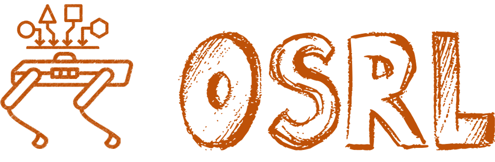

<div align="center">
  <a href="http://fsrl.readthedocs.io"></a>
</div>

<br/>

<div align="center">

  <a></a>
  [](#license)
  <!-- [](https://fsrl.readthedocs.io) -->
  <!-- [](https://codecov.io/github/liuzuxin/fsrl)
  [](https://github.com/liuzuxin/fsrl/actions/workflows/test.yml) -->
  <!-- [](https://app.codecov.io/gh/liuzuxin/fsrl) -->
  <!-- [](https://github.com/liuzuxin/fsrl/tree/HEAD/tests) -->
  <!-- [](https://pypi.org/project/fsrl) -->
  <!-- [](https://github.com/liuzuxin/fsrl/stargazers)
  [](https://pepy.tech/project/fsrl) -->
   <!-- [](#license) -->

</div>

---

**OSRL (Offline Safe Reinforcement Learning)** offers a collection of elegant and extensible implementations of state-of-the-art offline safe reinforcement learning (RL) algorithms. Aimed at propelling research in offline safe RL, OSRL serves as a solid foundation to implement, benchmark, and iterate on safe RL solutions.

The OSRL package is a crucial component of our larger benchmarking suite for offline safe learning, which also includes [FSRL](https://github.com/liuzuxin/fsrl) and [DSRL](https://github.com/liuzuxin/dsrl), and is built to facilitate the development of robust and reliable offline safe RL solutions.

To learn more, please visit our [project website](http://www.offline-saferl.org).

## Structure
The structure of this repo is as follows:
```
├── osrl  # offline safe RL algorithms
│   ├── common_net.py
│   ├── common_util.py
│   ├── xx_algorithm.py
│   ├── xx_algorithm_util.py
│   ├── ...
```

## Installation
Pull the repo and install:
```
git clone https://github.com/liuzuxin/osrl.git
cd osrl
pip install -e .
```

## How to use OSRL

The example usage are in the `examples` folder, where you can find the training and evaluation scripts for all the algorithms.

For example, to train the `bcql` method, simply run by overriding the default parameters:

```shell
python examples/train/train_bcql.py --param1 args1
```
All the parameters and their default configs for each algorithm are available in the `examples/configs` folder.